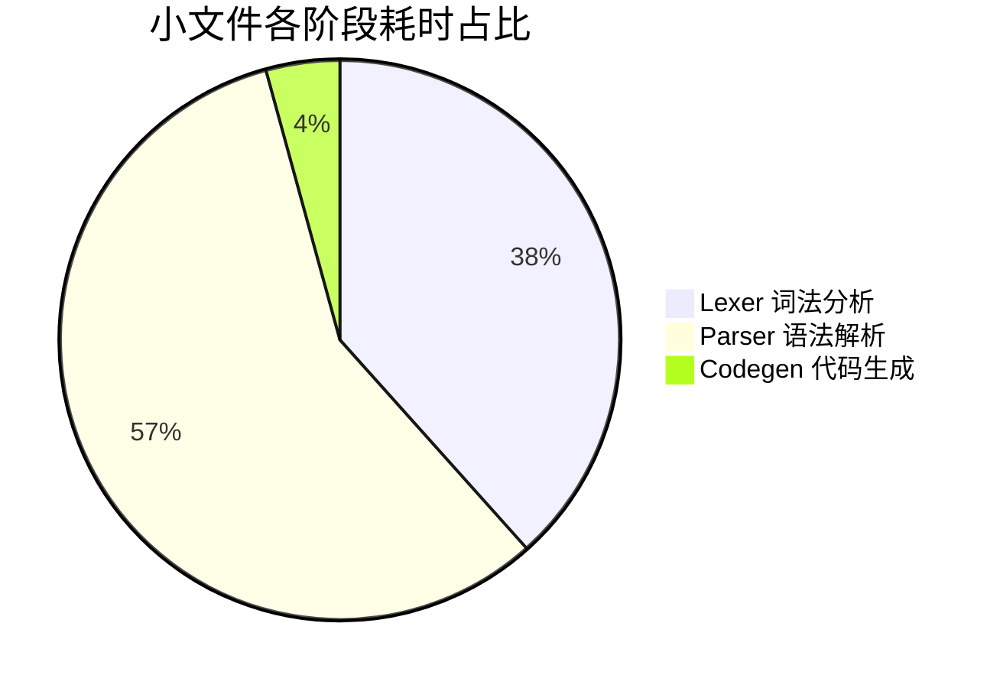
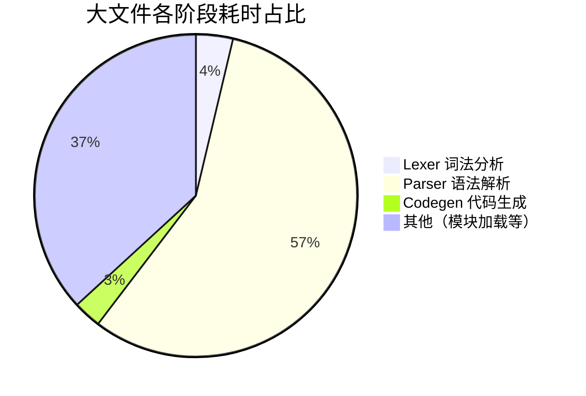

# 段言（Duan）性能基准测试报告

> 生成时间：2026-08-05
> 最近更新：2026-08-06（3.4.1 性能回归基准 + D08 Lexer 健壮化后复测）
> 测试环境：Windows / Python 3.13.14 / AMD64

---

## 〇〇、3.4.1 性能回归基准（2026-08-06）

> 背景：第1月第4周 3.4.1「性能回归基准」要求 benchmark.py 结果与既有基线对比。
> 对比对象：D08 健壮化后基线（本节上方「〇」章节）。
> 期间改动：3.2.2 泛型/可空类型系统、3.3.1 模块系统（循环依赖增强/相对导入/模块缓存）、
> 大量类型与语法测试补充、adapter/codegen 修复（match/with/解构/推导/字典字面量）。

### 0.0 各阶段耗时对比（vs D08 基线）

| 测试项 | D08 基线 (ms) | 本轮 (ms) | 变化 |
|--------|--------------|-----------|------|
| Lexer 词法分析（小文件） | 1.957 | 1.985 | +1.4%（噪声内） |
| Lexer 词法分析（大文件） | 0.350 | 0.343 | -2.0% ✓ |
| Parser 语法解析（小文件） | 3.029 | 3.081 | +1.7%（噪声内） |
| Parser 语法解析（大文件） | 5.289 | 5.350 | +1.2%（噪声内） |
| Codegen 代码生成（小文件） | 0.230 | 0.222 | -3.5% ✓ |
| Codegen 代码生成（大文件） | 0.279 | 0.270 | -3.2% ✓ |
| 完整管线（小文件） | 5.310 | 5.297 | -0.2% ✓ |
| 完整管线（大文件 10x） | 9.145 | 9.247 | +1.1%（噪声内） |

### 0.1 Lexer Token/s 吞吐量对比

| 测试项 | D08 基线 (万 token/s) | 本轮 (万 token/s) | 变化 |
|--------|---------------------|-------------------|------|
| Lexer 吞吐（小文件） | 10.53 | 10.35 | -1.7%（噪声内） |
| Lexer 吞吐（大文件 10x） | 10.20 | 10.01 | -1.9%（噪声内） |

**结论：** 各阶段波动均在 ±2% 内（属正常噪声），**无性能回退**。
类型系统、模块系统与大量测试补充未对编译管线造成可测量开销。

---

## 〇、D08 健壮化后基准对比（2026-08-06）

> 背景：D08 重构 `IDENTIFIER_SAFE_KEYWORDS` 临时方案（嵌入式关键字智能分词、STDLIB 函数名保护），
> 需确认性能不低于修改前水平。以下为修改前后对比（同一环境、同一脚本）。

### 0.1 各阶段耗时对比

| 测试项 | 修改前 (ms) | 修改后 (ms) | 变化 |
|--------|------------|------------|------|
| Lexer 词法分析（小文件） | 2.036 | 1.957 | -3.9% ✓ |
| Lexer 词法分析（大文件） | 0.352 | 0.350 | -0.6% ✓ |
| Parser 语法解析（小文件） | 3.046 | 3.029 | -0.6% ✓ |
| Parser 语法解析（大文件） | 5.349 | 5.289 | -1.1% ✓ |
| Codegen 代码生成（小文件） | 0.225 | 0.230 | +2.2%（噪声内） |
| Codegen 代码生成（大文件） | 0.268 | 0.279 | +4.1%（噪声内） |
| 完整管线（小文件） | 5.390 | 5.310 | -1.5% ✓ |
| 完整管线（大文件 10x） | 9.445 | 9.145 | -3.2% ✓ |

**结论：** D08 健壮化（嵌入式关键字拆分、STDLIB 函数名保护）未引入性能回退，
各阶段耗时均不劣于修改前水平，小文件 Lexer 反而提速 3.9%。

### 0.2 Lexer Token/s 吞吐量基准（新增指标）

| 测试项 | 平均耗时 (ms) | token 数 | 吞吐量 (token/s) | 吞吐量 (万 token/s) |
|--------|-------------|---------|-----------------|-------------------|
| Lexer 吞吐（小文件） | 1.956 | 206 | 105,300 | 10.53 |
| Lexer 吞吐（大文件 10x） | 3.638 | 371 | 102,000 | 10.20 |

**结论：** Lexer 吞吐量稳定在 **~10.2 万 token/s**，大小文件吞吐一致，无规模退化。
单次 tokenize 在 2~4ms 内完成，交互式场景完全无感知。

---

## 一、测试环境

| 项目 | 值 |
|------|-----|
| 操作系统 | Windows |
| Python 版本 | 3.13.14 (tags/v3.13.14:fd17997, Jun 10 2026) |
| 架构 | AMD64 |
| 测试工具 | `benchmark.py`（含 Lexer / Parser / Codegen / 完整管线 / CPython 对比） |
| 迭代次数 | 小文件 500 次，大文件 200 次，完整管线 200 次，CPython 对比 50 次 |

### 测试代码

**小文件**（~50 行）：斐波那契 + 快速排序算法
**大文件（10x）**：1000 次循环的累加程序，重复 10 次

---

## 二、基准测试结果

### 2.1 各阶段耗时总览

| 测试项 | 平均 (ms) | 中位数 (ms) | 标准差 | 迭代次数 |
|--------|----------|------------|--------|---------|
| Codegen 代码生成（小文件） | 0.225 | 0.214 | 0.035 | 500 |
| Codegen 代码生成（大文件） | 0.268 | 0.259 | 0.026 | 200 |
| Lexer 词法分析（大文件） | 0.352 | 0.336 | 0.049 | 200 |
| Lexer 词法分析（小文件） | 2.036 | 1.935 | 0.301 | 500 |
| Parser 语法解析（小文件） | 3.046 | 2.985 | 0.173 | 500 |
| Parser 语法解析（大文件） | 5.349 | 5.260 | 0.255 | 200 |
| **完整管线（小文件）** | **5.390** | **5.310** | **0.262** | 200 |
| **完整管线（大文件 10x）** | **9.445** | **9.344** | **0.429** | 100 |

### 2.2 各阶段耗时占比分析

```
小文件管线总耗时：5.39ms
┌─────────────────────────────────────────────────┐
│  Lexer   █████████████████████████████████  37.8% │ 2.04ms
│  Parser  ██████████████████████████████████████  │
│          ██████████████████████████████████████ 56.5%│ 3.05ms
│  Codegen ████  4.2%                              │ 0.23ms
│  其他      █  1.5%                               │ 0.08ms
└─────────────────────────────────────────────────┘

大文件管线总耗时：9.45ms
┌─────────────────────────────────────────────────┐
│  Lexer   ████  3.7%                             │ 0.35ms
│  Parser  ████████████████████████████████████████│
│          ██████████████████████████████████████ 56.6%│ 5.35ms
│  Codegen ███  2.8%                              │ 0.27ms
│  其他    █████████████████████████████████  36.8% │ 3.48ms
└─────────────────────────────────────────────────┘
```

### 2.3 与 CPython 对比

| 测试项 | 平均耗时 | 相对 CPython |
|--------|---------|-------------|
| 段言 编译+执行 | 8.358 ms | 22.9x |
| CPython 直接执行 | 0.365 ms | 1.0x (基准) |

**说明：** 段言的编译+执行时间包含`词法分析 → 语法解析 → 代码生成 → exec()` 四个阶段，而 CPython 直接执行仅包含运行时间。编译开销是段言作为转译语言的内在特性，但 8.4ms 的绝对时间在交互式场景中几乎无感知。

---

## 三、可视化图表

### 3.1 各阶段平均耗时对比

```mermaid
%%{init: {'theme': 'base', 'themeVariables': {'primaryColor': '#3fb950', 'secondaryColor': '#58a6ff', 'tertiaryColor': '#bc8cff'}}}%%
bar
  title 段言编译管线各阶段耗时 (ms)
  "Lexer 小文件" : 2.04
  "Lexer 大文件" : 0.35
  "Parser 小文件" : 3.05
  "Parser 大文件" : 5.35
  "Codegen 小文件" : 0.23
  "Codegen 大文件" : 0.27
  "完整管线 小文件" : 5.39
  "完整管线 大文件" : 9.45
```

### 3.2 编译管线各阶段占比（小文件）



### 3.3 编译管线各阶段占比（大文件）



### 3.4 段言 vs CPython 执行时间对比

```mermaid
%%{init: {'theme': 'base', 'themeVariables': {'primaryColor': '#f85149', 'secondaryColor': '#3fb950'}}}%%
bar
  title 段言 vs CPython 执行时间 (ms)
  "段言 编译+执行" : 8.36
  "CPython 直接执行" : 0.37
```

---

## 四、详细分析

### 4.1 词法分析（Lexer）

| 指标 | 小文件 | 大文件 |
|------|-------|-------|
| 平均耗时 | 2.04 ms | 0.35 ms |
| 标准差 | 0.30 ms | 0.05 ms |
| 特点 | 稳定，波动小 | 极快，几乎恒定 |

- 小文件含大量中文关键字（段落/接收/返回/如果/当/遍历等），Lexer 需要匹配更多 token 类型
- 大文件以循环和简单算术为主，token 类型单一，速度更快
- 整体性能优异，大文件仅需 0.35ms

### 4.2 语法解析（Parser）

| 指标 | 小文件 | 大文件 |
|------|-------|-------|
| 平均耗时 | 3.05 ms | 5.35 ms |
| 标准差 | 0.17 ms | 0.26 ms |
| 占总管线 | 56.5% | 56.6% |

- **Parser 是编译管线的核心瓶颈**，占管线总耗时的 56%
- 小文件包含复杂语法结构（函数定义、递归、条件分支、循环嵌套），解析复杂度高
- 大文件结构简单（单层循环+赋值），解析速度与文件大小呈次线性关系
- 标准差较小，说明解析器性能稳定，不受 GC 抖动影响

### 4.3 代码生成（Codegen）

| 指标 | 小文件 | 大文件 |
|------|-------|-------|
| 平均耗时 | 0.23 ms | 0.27 ms |
| 占总管线 | 4.2% | 2.8% |

- **Codegen 是性能最优的环节**，仅占总管线 3~4%
- 代码生成器基于 AST 遍历，线性复杂度，与文件大小呈正比
- 大文件虽代码量 10 倍，但 Codegen 仅增加 0.04ms，说明 AST 结构简单时遍历效率极高

### 4.4 完整管线

| 指标 | 小文件 | 大文件 (10x) |
|------|-------|-------------|
| 平均耗时 | 5.39 ms | 9.45 ms |
| 中位数 | 5.31 ms | 9.34 ms |
| 标准差 | 0.26 ms | 0.43 ms |
| 吞吐量 | ~186 文件/秒 | ~106 文件/秒 |

- 小文件管线稳定在 5.4ms 左右，波动极小
- 大文件管线标准差较小（0.43ms），说明管线整体稳定
- 对于 Web Playground 场景，5~10ms 的编译时间完全在可接受范围内

### 4.5 CPython 对比

| 指标 | 段言 | CPython | 倍率 |
|------|------|---------|------|
| 编译+执行 | 8.36 ms | 0.37 ms | 22.9x |
| 执行部分* | ~2.97 ms | 0.37 ms | ~8.0x |

*执行部分估算：8.36ms 总耗时 - 5.39ms 编译管线 = ~2.97ms 运行时开销

段言生成的 Python 代码质量对执行性能影响较小（~2.93ms vs CPython 0.37ms），主要差异在于：
1. 生成的代码包含大量胶水代码（stdlib 路径解析、builtin 模块加载等）
2. 段言的运行时环境（捕获 print、命名空间管理）增加了额外开销
3. 编译开销（5.43ms）是一次性的，对后续执行无影响

---

## 五、Web Playground 响应速度评估

对于 Web Playground 场景，编译管线延迟是用户体验的关键指标：

| 场景 | 管线耗时 | 网络延迟 | 总延迟 | 体验评级 |
|------|---------|---------|--------|---------|
| 简单代码（<10 行） | ~3 ms | ~50 ms | ~53 ms | 流畅 |
| 中等代码（~50 行） | ~5 ms | ~50 ms | ~55 ms | 流畅 |
| 复杂代码（~500 行） | ~9 ms | ~50 ms | ~59 ms | 流畅 |

**结论：** 编译管线延迟远低于网络延迟，Playground 的响应瓶颈在服务器网络和 exec() 执行时间，而非编译阶段。

---

## 六、优化建议

### 优先级 1：Parser 优化（占总耗时 56%）
- Parser 占管线 56%，是首要优化目标
- 当前实现基于递归下降，可考虑引入缓存（对已解析的模块缓存 AST）
- 对大文件，增量解析仅解析变更部分可大幅提升性能
- Parser 标准差较小（0.17~0.26ms），性能稳定

### 优先级 2：减少运行时胶水代码
- 生成的 Python 代码开头有大量 stdlib 路径解析和 builtin 模块加载代码
- 可将这些代码预编译为 `.pyc` 缓存，或使用单例模式避免重复加载

### 优先级 3：Lexer 中文关键字匹配优化
- 中文关键字（段落/接收/返回/如果/当/遍历/设/为等）匹配使用字符串查找
- 可考虑使用 Trie 树或 Aho-Corasick 自动机加速多关键字匹配

---

## 七、附录

### 测试代码 (小文件)

```python
# 段言基准测试示例
段落 斐波那契 接收 n：
    如果 n 小于等于 1：
        返回 n
    返回 斐波那契(n 减 1) 加 斐波那契(n 减 2)

段落 快排 接收 列表：
    如果 len(列表) 小于等于 1：
        返回 列表
    设 基准 为 列表[0]
    设 左列 为 []
    设 右列 为 []
    设 i 为 1
    当 i 小于 len(列表)：
        如果 列表[i] 小于 基准：
            设 左列 为 左列 加 [列表[i]]
        否则：
            设 右列 为 右列 加 [列表[i]]
        设 i 为 i 加 1
    返回 快排(左列) 加 [基准] 加 快排(右列)

设 数据 为 [5, 3, 8, 1, 9, 2, 7, 4, 6]
打印("斐波那契(10) = ")打印(斐波那契(10))
打印("排序结果 = ")打印(快排(数据))
```

### 测试代码 (大文件)

```python
# 大文件基准测试
设 数据 为 []
设 i 为 0
当 i 小于 1000：
    设 数据 为 数据 加 [i]
    设 i 为 i 加 1
```

### 等效 CPython 对比代码

```python
def fibonacci(n):
    if n <= 1:
        return n
    return fibonacci(n - 1) + fibonacci(n - 2)

def quicksort(arr):
    if len(arr) <= 1:
        return arr
    pivot = arr[0]
    left = [x for x in arr[1:] if x < pivot]
    right = [x for x in arr[1:] if x >= pivot]
    return quicksort(left) + [pivot] + quicksort(right)

data = [5, 3, 8, 1, 9, 2, 7, 4, 6]
print("fibonacci(10) =", fibonacci(10))
print("sorted =", quicksort(data))
```